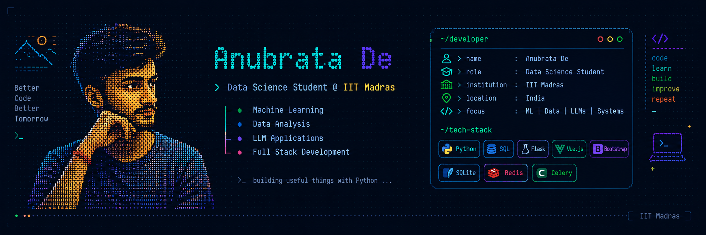

  

  

  
  
  

---

## Projects

<table>
<tr>

<td width="50%" valign="top">

<h3>Data Analyst Agent</h3>

LLM-powered data analysis and visualization workflow that accepts natural-language tasks with data files and produces automated analysis.

</td>

<td width="50%" valign="top">

<h3>ParkEase</h3>

Full-stack vehicle parking management system with booking, dynamic allocation, authentication, caching and background tasks.

</td>

</tr>

<tr>

<td width="50%" valign="top">

<h3>Placement Portal</h3>

Role-based recruitment platform for students, companies and administrators with placement drives, applications and eligibility management.

</td>

<td width="50%" valign="top">

<h3>Virtual Teaching Assistant</h3>

AI-powered assistant for IIT Madras TDS that uses course material and discussions to provide contextual answers and references.

</td>

</tr>

<tr>

<td width="50%" valign="top">

<h3>Quiz Master V1</h3>

Multi-user exam preparation platform built as a web application.

</td>

<td width="50%" valign="top">

<h3>Prompt2PPT</h3>

Application focused on generating presentations from user prompts.

</td>

</tr>
</table>

---

## Machine Learning

<table>
<tr>

<td width="25%" align="center">

**Hotel Booking Cancellation**

 

</td>

<td width="25%" align="center">

**House Price Prediction**

 

</td>

<td width="25%" align="center">

**Movie Review Sentiment**

 

</td>

<td width="25%" align="center">

**Cinema Audience Forecasting**

 

</td>

</tr>
</table>

---

# Tech Stack

### Languages

### Frameworks & Tools

### Areas

`Data Science` · `Machine Learning` · `LLM Applications` · `Data Analysis` · `REST APIs`

---

## GitHub Stats

 

 

  

---

## Contribution Activity

  

---

  <a href="https://www.linkedin.com/in/anubratade/">LinkedIn</a>
  ·
  <a href="https://github.com/anubrata-de">GitHub</a>
  ·
  <a href="https://www.instagram.com/anubrata.de/">Instagram</a>

